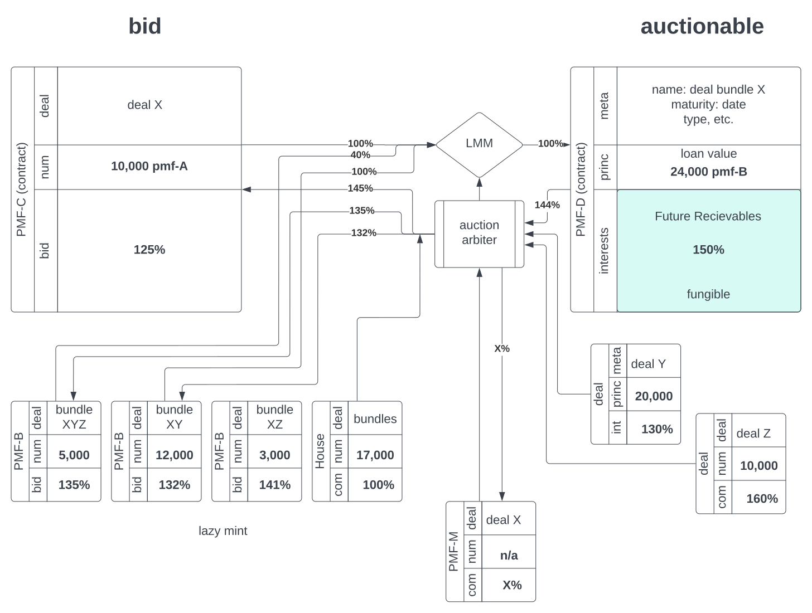

<style>img[alt=logo] { width: 124px; float: right }</style>


## Jumpstart Innovation

This project is fairly new, nevertheless it is very exciting
as it removes barrier to anyone with cryptocurrency to support
startup projects.

### Abstract

JumpstartVenture is a automatic platform cash advance that open risk-capital market to high-risk early startup.
The ffcoin incentivizes investors by offering a better return on investment from high-risk clients.
Investors earn ffcoins from fiat investments. Coin values increase upon cash reimbursements.

There are numerous startups that don’t have access to credit
due to the stage the company is in or nature of their market or their past financial history;
irrespective of revenue generation.
The ffCoin is allowing an investor to purchase the company’s future income at a discount.


<style>img[alt=autionmaker] { width: 100%; }</style>

It works as follows:

- A company with projected revenues is approved by the underwriting department to secure a cash advance for 100K for purchasing 150K of future income over the next 4 months. An investor enters a deal to buy $150K of revenue for the price of $100K. When the company collects its revenues at $150K over a period of 4 months, the investor makes a 50K ROI (minus fees).
- By using a ffcoin, the loan can be fractionalized so that several investors can participate together in providing the funds.
- Distributing an individual investor’s funds across a large set of deals, lowers the risk of a single investment and the diversification provides a natural “mutualization” of the risk.
- Because cryptography allows a quasi-infinite fractionalization, the ffCoin allows the investor to have a continuum between low and high-risk deals for an optimized investment strategy.
- The low-risk coin behaves like a stable coin with a flat price curve, while a higher-risk coin presents more volatility and a hyperbolic price curve

The ffcoin is exchanged within a liquidity pool with the fiat/ffcoin pair.
The participants purchase the ffCoin at a spot price determined by the fiat/coin ratio. The fiat reserve is used for loans and back payments. The investor’s portfolio is comprised of ffCoins. Returns are paid in ffCoins.
ffCoin Ecosystem
For every USD put in a pull reserve (1) we mint a ffCoin and place it in a liquidity pool (2). Investors can buy ffCoin (3) from the JumpStart platform (4) or from available DEX when exchanged with other mainstream cryptocurrencies.
JumpStart lends fiats to companies while they enter a deal and buy back their loans at a negotiated rate (6). Investors can sell their ffCoin (7) at anytime cashing out (8) on the value gained by the coin.

### Architectural Choices

2 contracts and 2 coins

#### Dual Coin Approach
In order to provide an audit trail for deposit made to the “reserve” a stable coin (ffffc) is issued for each dollars in the reserve account.

This stable coin allow the purchase of investment coin (ffc-B) for participating in auctionable deals.
- ffc-A coin: stable coin
- ffc-B coin: investors coin

#### Dual Contract Approach
In order to define the optimal lending and borrowing rates we decided to have two contract for each sides
- ffc-C contract: bid token
- ffc-D contract: deal token
each investor has a wallet with the address of the format: zPMiqwsvegUxMbzoxmkEU27Y825Nq8F6KaJizSbDC3xM

For each monetary deposit on the account associated with the wallet a ffc-A coin is minted (tokenid: pmfAmBsVHefiYejfCipVoztTPqzqPxw3Qt3C7rtxjMm).
ffc-A coins are used in auctions bid on deals. A deal is a signed token with fixes value and ROI A bid is a signed token wrapping a given number of ffc-A coins at an expected yield for a bundle of deals.

#### Auctionable Deals
    1. a set of deals are presented to investors
    2. investors select a bundle of deals to invest in.
    3. investors commit ffc-A coin by attaching them to a bid token for the bundle
    4. an arbiter select the bids to make the deal bundle
    5. the wining bids ffc-A coin are converted to ffc-B coin
    6. return are distributed according to committed yield

#### Auction Arbitration
    1. validation of bids
    2. ranking of bids
    3. selection of winning bids
    4. verify zero-sum proposal
    5. announce of winning bids

#### Execution
    1. mint deal tokens
    2. mint commitment tokens
    3. close or re-iterate deals
    4. transfer funds
    5. sign off

#### API endpoints:
    • /api/v0/register
    • /api/v0/signin
    • /api/v0/setdeal
    • /api/v0/listdeals
    • /api/v0/setbundle
    • /api/v0/commitbid
    • /api/v0/listbids
    • /api/v0/rankbids
    • /api/v0/listwinners
    • /api/v0/mintbid
    • /api/v0/mintdeal
    • /api/v0/executedeal
    • /api/v0/canceldeal
    • /api/v0/closedeal
    • /api/v0/signoff

### API documentation:

Entities
```
--- # ffc-A Stable Coin
name: ffc-A
symbol: ffca
type: stable
fee: 0.3%
price: curve-a.csv
...
```
```
--- # ffc-B Token
name: ffc-B
symbol: ffcb
type: speculative
fee: 0.3%
price curve-b.csv
...
```
```
--- # bid token
name: ffc-bid
symbol: ffcc
type: bid
bundle: bdlXYZ
shares: 10,000 ffca
bid: 125%
signature: xxx
...
```
```
--- # deal token
name: ffc-deal
symbol: ffcd
type: deal
metadata: address
principal: 24,000 ffca
roi: 150%
fee: 3%
signature: xxx
...
```
```
--- # deal bundle
- deal1address
- deal2address
- deal3address
...
```
```
--- # wining bids
# [id,num,inv,yield]
- [bidid1, 10_000,100%, 125%]
- [bidid2, 5_000,40%, 135%]
- [bidid3, 3_000,100, 125%]
- ...
```


+[Michel](https://duckduckgo.com/?q=Michel+Combes+blockchain)
